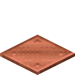
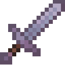
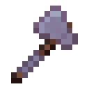
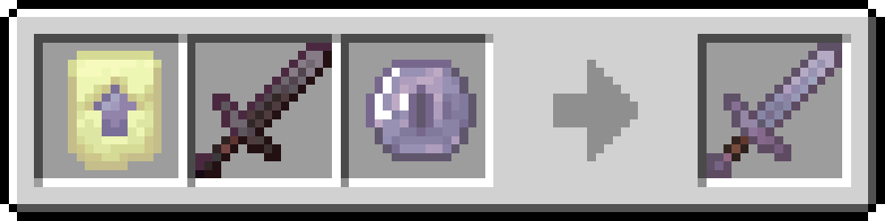
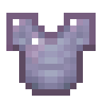
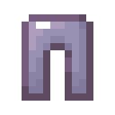
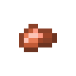
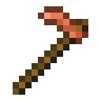

# Items and Blocks


Copper tools, armor, and nuggets are **only on 1.21.1**. On 1.21.11 they are vanilla — the mod does not add them.


## Blocks

### Void Shard



<figure><figcaption>
Void Shard — block
</figcaption></figure>



**ID:** `captercraft:void_shard`\
**Versions:** 1.21.1 · 1.21.11





Rare End ore. Generates in end stone on the outer islands (`end_highlands`, `end_midlands`, `end_barrens`, `small_end_islands`), Y 32–80. Veins of size 3 plus smaller veins of size 2.

Hardness 30 / 1200. Needs a **diamond** pickaxe or better to drop. Mining always drops the Void Shard block (1.21.1 and 1.21.11). Immune to normal explosions, like ancient debris. Fire resistant as an item.



Smelt or blast into an Enderite Shard.



### Block of Enderite



<figure><figcaption>
Block of Enderite — block
</figcaption></figure>



**ID:** `captercraft:block_of_enderite`\
**Versions:** 1.21.1 · 1.21.11





Storage and decoration. Purple netherite-like block. Hardness 50 / 1200. Fire resistant. Needs a **diamond** pickaxe or better to drop.



|                                          9 ingots → 1 block                                         |                                            1 block → 9 ingots                                           |
| :-------------------------------------------------------------------------------------------------: | :-----------------------------------------------------------------------------------------------------: |
| .png>) |  |



Compact storage for Enderite Ingots. Decorative building block.



### Medium Weighted Pressure Plate



<figure><figcaption>
Medium Weighted Pressure Plate — block
</figcaption></figure>



**ID:** `captercraft:medium_weighted_pressure_plate`\
**Versions:** 1.21.1 · 1.21.11





Copper weighted plate. Activates with **75 entities**. Sits between the light (gold) and heavy (iron) vanilla plates.



<figure><figcaption>
Crafting grid
</figcaption></figure>



Redstone input. Signal strength scales with entities on the plate, up to 75.



## Items

### Enderite Shard



<figure><figcaption>
Enderite Shard — item
</figcaption></figure>



**ID:** `captercraft:enderite_shard`\
**Versions:** 1.21.1 · 1.21.11





Fire-resistant crafting material. The only way to get it is to smelt or blast a Void Shard in a furnace or blast furnace (1.21.1 and 1.21.11). Mining the ore drops the block, not this shard.



| Input      | Output         | Furnace | Blast furnace | XP |
| ---------- | -------------- | ------- | ------------- | -- |
| Void Shard | Enderite Shard | 15s     | 10s           | 3  |

<figure><figcaption>
Furnace / blast furnace
</figcaption></figure>



Crafted into Enderite Ingots with diamonds and an eye of Ender.



### Enderite Ingot



<figure><figcaption>
Enderite Ingot — item
</figcaption></figure>



**ID:** `captercraft:enderite_ingot`\
**Versions:** 1.21.1 · 1.21.11





Fire-resistant end-game metal. Repairs Enderite gear. Used at the smithing table to upgrade netherite.



<figure><figcaption>
Crafting grid
</figcaption></figure>



* Craft Block of Enderite (9 ingots)
* Smith netherite tools and armor into Enderite
* Repair Enderite equipment



### Enderite Upgrade Smithing Template



<figure><figcaption>
Enderite Upgrade Smithing Template — item
</figcaption></figure>



**ID:** `captercraft:enderite_upgrade_smithing_template`\
**Versions:** 1.21.1 · 1.21.11





Smithing template. Applies to netherite equipment. Addition: Enderite Ingot.

No chest loot table was found in the mod data. The first copy is in the CapterCraft creative tab. Extra copies are crafted from an existing template.



<figure><figcaption>
Crafting grid — 1 template into 2
</figcaption></figure>



Smithing table: netherite item + Enderite Ingot + this template → Enderite item.



## Enderite Equipment

**Versions:** 1.21.1 · 1.21.11\
Fire resistant. Repair with Enderite Ingots. Enchantability 18. Tool durability **3120**, mining speed **10.0**, attack bonus **+5.0**. Armor durability multiplier **42**, toughness **4.5**, knockback resistance **0.2**.

Crafted only at a **smithing table**: netherite piece + Enderite Ingot + Enderite Upgrade Smithing Template.



## Mine Void Shard

Outer End islands, Y 32–80.



## Smelt an Enderite Shard

Furnace or blast furnace.



## Craft an Enderite Ingot

Diamonds, Enderite Shards, and an eye of Ender.



## Duplicate the Template

Diamonds, an existing Enderite Upgrade Smithing Template, and end stone.



## Smith Netherite

Template + matching netherite piece + Enderite Ingot.



### Enderite Tools

|                     Enderite Sword                    |                      Enderite Pickaxe                     |                    Enderite Axe                   |                     Enderite Shovel                     |                    Enderite Hoe                   |
| :---------------------------------------------------: | :-------------------------------------------------------: | :-----------------------------------------------: | :-----------------------------------------------------: | :-----------------------------------------------: |
|  |  |  |  |  |



| Item             | ID                             | Attack | Speed |
| ---------------- | ------------------------------ | ------ | ----- |
| Enderite Sword   | `captercraft:enderite_sword`   | 3.0    | −2.0  |
| Enderite Pickaxe | `captercraft:enderite_pickaxe` | 1.0    | −2.4  |
| Enderite Axe     | `captercraft:enderite_axe`     | 5.0    | −2.5  |
| Enderite Shovel  | `captercraft:enderite_shovel`  | 1.5    | −2.5  |
| Enderite Hoe     | `captercraft:enderite_hoe`     | −4.0   | 1.0   |



<figure><figcaption>
Smithing table — all five tools
</figcaption></figure>

Smithing table for each piece:

1. Enderite Upgrade Smithing Template
2. Matching **netherite** tool
3. Enderite Ingot



End-game tools above netherite. Do not burn in fire or lava.



### Enderite Armor

|                     Enderite Helmet                     |                       Enderite Chestplate                       |                      Enderite Leggings                      |                     Enderite Boots                    |
| :-----------------------------------------------------: | :-------------------------------------------------------------: | :---------------------------------------------------------: | :---------------------------------------------------: |
|  |  |  |  |



| Item                | ID                                | Defense |
| ------------------- | --------------------------------- | ------- |
| Enderite Helmet     | `captercraft:enderite_helmet`     | 4       |
| Enderite Chestplate | `captercraft:enderite_chestplate` | 9       |
| Enderite Leggings   | `captercraft:enderite_leggings`   | 7       |
| Enderite Boots      | `captercraft:enderite_boots`      | 4       |



<figure><figcaption>
Smithing table — all four pieces
</figcaption></figure>

Smithing table for each piece: template + matching **netherite** armor + Enderite Ingot.



End-game armor above netherite. Fire resistant.



## Extra Recipes

These do not add items. They work on **1.21.1 and 1.21.11**.

| Input            | Output       | Furnace | Blast furnace | XP  |
| ---------------- | ------------ | ------- | ------------- | --- |
| Raw Iron Block   | Iron Block   | 90s     | 45s           | 6.3 |
| Raw Gold Block   | Gold Block   | 90s     | 45s           | 6.3 |
| Raw Copper Block | Copper Block | 90s     | 45s           | 6.3 |

<figure><figcaption>
Furnace / blast furnace — iron, gold, and copper
</figcaption></figure>

Copper (Minecraft 1.21.1 only)

On 1.21.11 use vanilla copper. Stats below are **1.0.1**.

### Copper Nugget

<figure><figcaption>
Copper Nugget — item
</figcaption></figure>

**ID:** `captercraft:copper_nugget`\
**Versions:** **1.21.1 only** (vanilla on 1.21.11)

Flexible copper crafting and recycling copper gear.Smelt or blast any copper tool or armor piece to recover 1 Copper Nugget.

### Copper Tools

|                    Copper Sword                   |                     Copper Pickaxe                    |                   Copper Axe                  |                    Copper Shovel                    |                   Copper Hoe                  |
| :-----------------------------------------------: | :---------------------------------------------------: | :-------------------------------------------: | :-------------------------------------------------: | :-------------------------------------------: |
|  |  |  |  |  |

Durability 190. Mining speed 5.0. Attack bonus +1.0. Enchantability 13. Harvest level matches stone. Repair with copper ingots.Early gear between stone and iron. Smelt or blast any piece to recover a Copper Nugget.

### Copper Armor

|                    Copper Helmet                    |                      Copper Chestplate                      |                     Copper Leggings                     |                    Copper Boots                   |
| :-------------------------------------------------: | :---------------------------------------------------------: | :-----------------------------------------------------: | :-----------------------------------------------: |
|  |  |  |  |

Durability multiplier 11 (helmet 121, chestplate 176, leggings 165, boots 143). Enchantability 8. Toughness 0.Early armor. Smelt or blast any piece to recover a Copper Nugget.

