# Items and Blocks


Copper tools, armor, and nuggets are **only on 1.21.1**. On 1.21.11 they are vanilla — the mod does not add them.


## Blocks

### Void Shard



<figure><figcaption><p>Void Shard — block</p></figcaption></figure>



**ID:** `captercraft:void_shard`  
**Versions:** 1.21.1 · 1.21.11





Rare End ore. Generates in end stone on the outer islands (`end_highlands`, `end_midlands`, `end_barrens`, `small_end_islands`), Y 32–80. Veins of size 3 plus smaller veins of size 2.

Hardness 30 / 1200. Needs the correct tool to drop. Fire resistant as an item.



- **Silk Touch** → Void Shard block
- **Otherwise** → Enderite Shard



Smelt or blast into an Enderite Shard.



### Block of Enderite



<figure>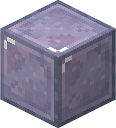<figcaption><p>Block of Enderite — block</p></figcaption></figure>



**ID:** `captercraft:block_of_enderite`  
**Versions:** 1.21.1 · 1.21.11





Storage and decoration. Purple netherite-like block. Hardness 50 / 1200. Fire resistant. Needs the correct tool to drop.





<figure><figcaption><p>9 ingots → 1 block</p></figcaption></figure>

Nine Enderite Ingots → 1 Block of Enderite.

```
I I I
I I I
I I I
```

`I` = Enderite Ingot



<figure>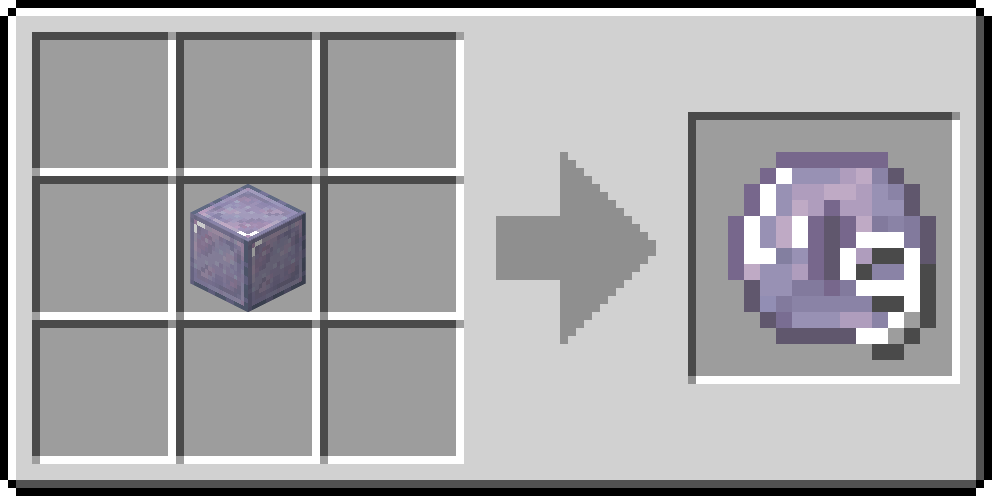<figcaption><p>1 block → 9 ingots</p></figcaption></figure>

Craft the block back into **9 ingots**.





Compact storage for Enderite Ingots. Decorative building block.



### Medium Weighted Pressure Plate



<figure><figcaption><p>Medium Weighted Pressure Plate — block</p></figcaption></figure>



**ID:** `captercraft:medium_weighted_pressure_plate`  
**Versions:** 1.21.1 · 1.21.11





Copper weighted plate. Activates with **75 entities**. Sits between the light (gold) and heavy (iron) vanilla plates.



<figure><figcaption><p>Crafting grid</p></figcaption></figure>

```
C C
```

`C` = Copper Ingot



Redstone input. Signal strength scales with entities on the plate, up to 75.



## Materials

### Enderite Shard



<figure><figcaption><p>Enderite Shard — item</p></figcaption></figure>



**ID:** `captercraft:enderite_shard`  
**Versions:** 1.21.1 · 1.21.11





Fire-resistant crafting material. Comes from Void Shard (smelting, blasting, or mining without Silk Touch).





<figure>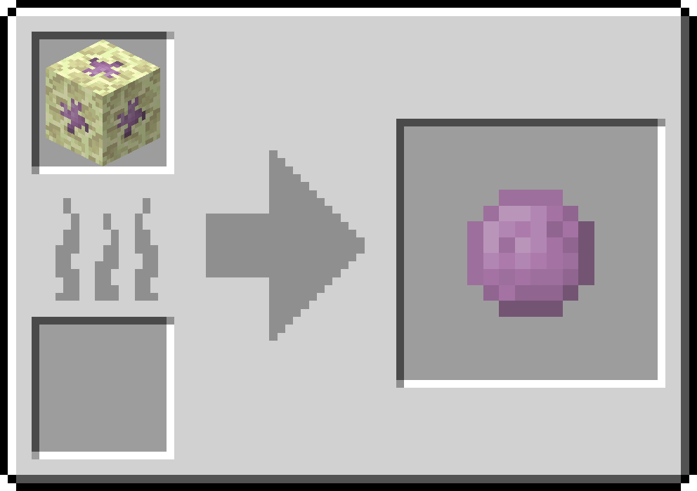<figcaption><p>Furnace — 15s, 3 XP</p></figcaption></figure>



<figure><figcaption><p>Blast furnace — 10s, 3 XP</p></figcaption></figure>



- **Furnace:** Void Shard → Enderite Shard (15s, 3 XP)
- **Blast furnace:** Void Shard → Enderite Shard (10s, 3 XP)



Crafted into Enderite Ingots with diamonds and an eye of Ender.



### Enderite Ingot



<figure><figcaption><p>Enderite Ingot — item</p></figcaption></figure>



**ID:** `captercraft:enderite_ingot`  
**Versions:** 1.21.1 · 1.21.11





Fire-resistant end-game metal. Repairs Enderite gear. Used at the smithing table to upgrade netherite.



<figure><figcaption><p>Crafting grid</p></figcaption></figure>

```
D S D
S E S
D S D
```

`D` = Diamond · `S` = Enderite Shard · `E` = Eye of Ender

Also: 1 Block of Enderite → 9 ingots.



- Craft Block of Enderite (9 ingots)
- Smith netherite tools and armor into Enderite
- Repair Enderite equipment



### Enderite Upgrade Smithing Template



<figure>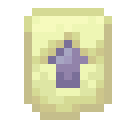<figcaption><p>Enderite Upgrade Smithing Template — item</p></figcaption></figure>



**ID:** `captercraft:enderite_upgrade_smithing_template`  
**Versions:** 1.21.1 · 1.21.11





Smithing template. Applies to netherite equipment. Addition: Enderite Ingot.

No chest loot table was found in the mod data. The first copy is in the CapterCraft creative tab. Extra copies are crafted from an existing template.



<figure>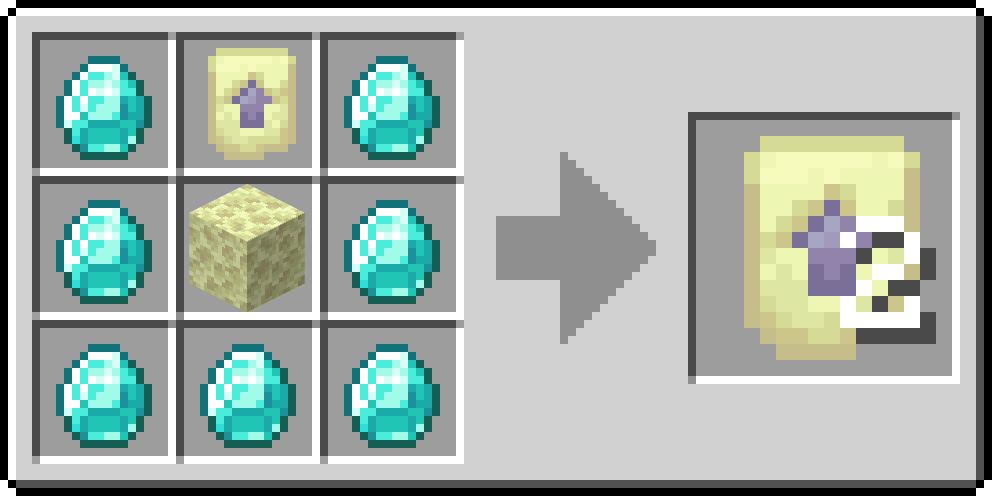<figcaption><p>Crafting grid — 1 template into 2</p></figcaption></figure>

Duplicates 1 template into 2:

```
D T D
D N D
D D D
```

`D` = Diamond · `T` = Enderite Upgrade Smithing Template · `N` = End Stone



Smithing table: netherite item + Enderite Ingot + this template → Enderite item.



## Enderite equipment

**Versions:** 1.21.1 · 1.21.11  
Fire resistant. Repair with Enderite Ingots. Enchantability 18. Tool durability **3120**, mining speed **10.0**, attack bonus **+5.0**. Armor durability multiplier **42**, toughness **4.5**, knockback resistance **0.2**.

Crafted only at a **smithing table**: netherite piece + Enderite Ingot + Enderite Upgrade Smithing Template.



## Mine Void Shard

Outer End islands, Y 32–80.



## Smelt an Enderite Shard

Furnace or blast furnace.



## Craft an Enderite Ingot

Diamonds, Enderite Shards, and an eye of Ender.



## Duplicate the template

Diamonds, an existing Enderite Upgrade Smithing Template, and end stone.



## Smith netherite

Template + matching netherite piece + Enderite Ingot.



### Enderite tools



<figure><figcaption><p>Sword</p></figcaption></figure>
<figure>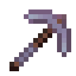<figcaption><p>Pickaxe</p></figcaption></figure>
<figure><figcaption><p>Axe</p></figcaption></figure>



<figure>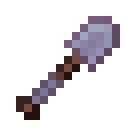<figcaption><p>Shovel</p></figcaption></figure>
<figure>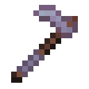<figcaption><p>Hoe</p></figcaption></figure>





| Item | ID | Attack | Speed |
|---|---|---|---|
| Enderite Sword | `captercraft:enderite_sword` | 3.0 | −2.0 |
| Enderite Pickaxe | `captercraft:enderite_pickaxe` | 1.0 | −2.4 |
| Enderite Axe | `captercraft:enderite_axe` | 5.0 | −2.5 |
| Enderite Shovel | `captercraft:enderite_shovel` | 1.5 | −2.5 |
| Enderite Hoe | `captercraft:enderite_hoe` | −4.0 | 1.0 |



<figure><figcaption><p>Smithing table</p></figcaption></figure>

Smithing table for each piece:

1. Enderite Upgrade Smithing Template
2. Matching **netherite** tool
3. Enderite Ingot



End-game tools above netherite. Do not burn in fire or lava.



### Enderite armor



<figure><figcaption><p>Helmet</p></figcaption></figure>
<figure><figcaption><p>Chestplate</p></figcaption></figure>



<figure><figcaption><p>Leggings</p></figcaption></figure>
<figure><figcaption><p>Boots</p></figcaption></figure>





| Item | ID | Defense |
|---|---|---|
| Enderite Helmet | `captercraft:enderite_helmet` | 4 |
| Enderite Chestplate | `captercraft:enderite_chestplate` | 9 |
| Enderite Leggings | `captercraft:enderite_leggings` | 7 |
| Enderite Boots | `captercraft:enderite_boots` | 4 |



<figure><figcaption><p>Smithing table</p></figcaption></figure>

Smithing table for each piece: template + matching **netherite** armor + Enderite Ingot.



End-game armor above netherite. Fire resistant.



## Extra recipes

These do not add items. They work on **1.21.1 and 1.21.11**.

| Input | Output | Furnace | Blast furnace | XP |
|---|---|---|---|---|
| Raw Iron Block | Iron Block | 90s | 45s | 6.3 |
| Raw Gold Block | Gold Block | 90s | 45s | 6.3 |
| Raw Copper Block | Copper Block | 90s | 45s | 6.3 |



<figure><figcaption><p>Raw iron — furnace / blast</p></figcaption></figure>



<figure><figcaption><p>Raw gold — furnace / blast</p></figcaption></figure>



<figure><figcaption><p>Raw copper — furnace / blast</p></figcaption></figure>

<details>
<summary>Copper (Minecraft 1.21.1 only)</summary>

On 1.21.11 use vanilla copper. Stats below are **1.0.1**.

### Copper Nugget

<figure><figcaption><p>Copper Nugget — item</p></figcaption></figure>

**ID:** `captercraft:copper_nugget`  
**Versions:** **1.21.1 only** (vanilla on 1.21.11)

<figure><figcaption><p>Crafting grid</p></figcaption></figure>

<figure><figcaption><p>Furnace / blast — recycle gear</p></figcaption></figure>

- 1 Copper Ingot → 9 Copper Nuggets
- 9 Copper Nuggets → 1 Copper Ingot
- Smelt or blast any copper tool or armor piece → 1 Copper Nugget (10s furnace / blast, 0.7 XP)

Flexible copper crafting and recycling copper gear.

### Copper tools

<figure>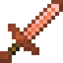<figcaption><p>Sword</p></figcaption></figure>
<figure>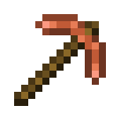<figcaption><p>Pickaxe</p></figcaption></figure>
<figure>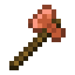<figcaption><p>Axe</p></figcaption></figure>
<figure><figcaption><p>Shovel</p></figcaption></figure>
<figure><figcaption><p>Hoe</p></figcaption></figure>

Durability **190**. Mining speed **5.0**. Attack bonus **+1.0**. Enchantability **13**. Harvest level matches stone. Repair with copper ingots.

| Item | ID | Attack | Speed |
|---|---|---|---|
| Copper Sword | `captercraft:copper_sword` | 3.0 | −2.4 |
| Copper Pickaxe | `captercraft:copper_pickaxe` | 1.0 | −2.8 |
| Copper Axe | `captercraft:copper_axe` | 7.0 | −3.2 |
| Copper Shovel | `captercraft:copper_shovel` | 1.5 | −3.0 |
| Copper Hoe | `captercraft:copper_hoe` | −1.0 | −2.0 |

<figure><figcaption><p>Crafting grid — sword (vanilla tool shapes)</p></figcaption></figure>

Vanilla tool shapes with copper ingots and a wooden rod.

```
C
C
S
```

`C` = Copper Ingot · `S` = Wooden rod

Early gear between stone and iron. Smelt or blast any piece to recover a Copper Nugget.

### Copper armor

<figure>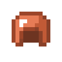<figcaption><p>Helmet</p></figcaption></figure>
<figure>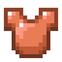<figcaption><p>Chestplate</p></figcaption></figure>
<figure><figcaption><p>Leggings</p></figcaption></figure>
<figure>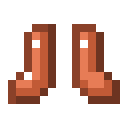<figcaption><p>Boots</p></figcaption></figure>

Durability multiplier **11** (helmet 121, chestplate 176, leggings 165, boots 143). Enchantability **8**. Toughness 0.

| Item | ID | Defense |
|---|---|---|
| Copper Helmet | `captercraft:copper_helmet` | 2 |
| Copper Chestplate | `captercraft:copper_chestplate` | 4 |
| Copper Leggings | `captercraft:copper_leggings` | 3 |
| Copper Boots | `captercraft:copper_boots` | 1 |

<figure><figcaption><p>Crafting grid — vanilla armor shapes</p></figcaption></figure>

Vanilla armor shapes with copper ingots. Early armor. Smelt or blast any piece to recover a Copper Nugget.

</details>
