# Ítems y Bloques


Las herramientas, la armadura y las pepitas de cobre están **solo en 1.21.1**. En 1.21.11 son vanilla: el mod no las añade.


## Bloques

### Fragmento del Vacío



<figure>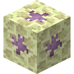<figcaption>
Fragmento del Vacío — bloque
</figcaption></figure>



**ID:** `captercraft:void_shard`  
**Versiones:** 1.21.1 · 1.21.11





Mena rara del End. Genera en piedra del End en las islas exteriores (`end_highlands`, `end_midlands`, `end_barrens`, `small_end_islands`), Y 32–80. Vetas de tamaño 3 y vetas más pequeñas de tamaño 2.

Dureza 30 / 1200. Necesita pico de **diamante** o superior para soltar botín. Al minar siempre suelta el bloque Fragmento del Vacío (1.21.1 y 1.21.11). Inmune a explosiones normales, como los escombros ancestrales. El ítem es resistente al fuego.



Quemar en horno o alto horno para obtener un Fragmento de Enderita.



### Bloque de Enderita



<figure><figcaption>
Bloque de Enderita — bloque
</figcaption></figure>



**ID:** `captercraft:block_of_enderite`  
**Versiones:** 1.21.1 · 1.21.11





Almacenamiento y decoración. Bloque púrpura al estilo netherita. Dureza 50 / 1200. Resistente al fuego. Necesita pico de **diamante** o superior para soltar botín.



| 9 lingotes → 1 bloque | 1 bloque → 9 lingotes |
| :---: | :---: |
| 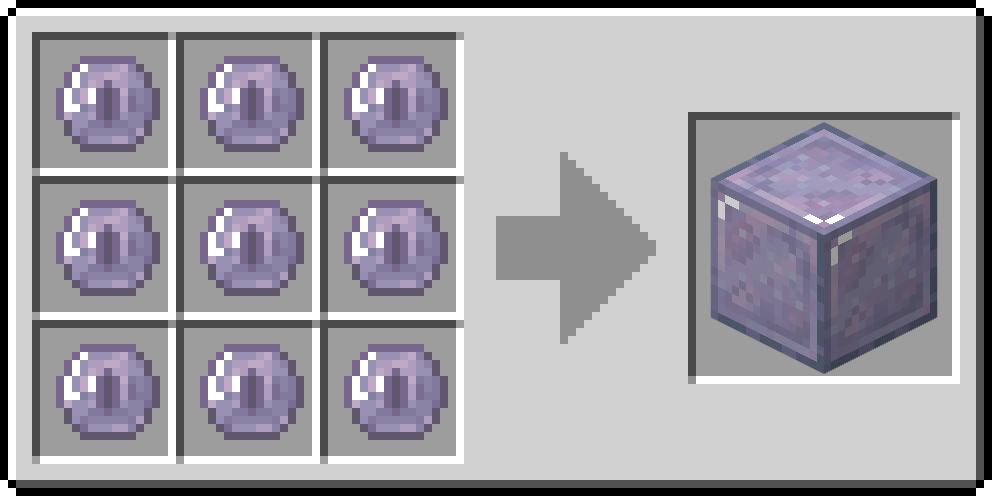 |  |



Guardar lingotes de enderita. Bloque decorativo.



### Placa de Presión para Peso Medio



<figure><figcaption>
Placa de Presión para Peso Medio — bloque
</figcaption></figure>



**ID:** `captercraft:medium_weighted_pressure_plate`  
**Versiones:** 1.21.1 · 1.21.11





Placa ponderada de cobre. Se activa con **75 entidades**. Queda entre la placa ligera (oro) y la pesada (hierro) de vanilla.



<figure>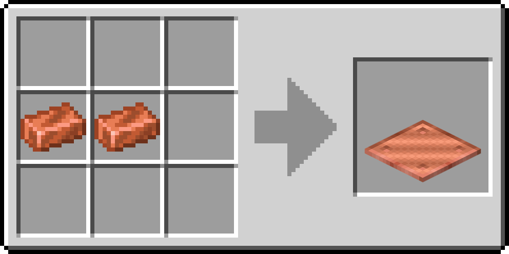<figcaption>
Cuadrícula de crafteo
</figcaption></figure>



Entrada de redstone. La potencia escala con las entidades encima, hasta 75.



## Ítems

### Fragmento de Enderita



<figure><figcaption>
Fragmento de Enderita — ítem
</figcaption></figure>



**ID:** `captercraft:enderite_shard`  
**Versiones:** 1.21.1 · 1.21.11





Material de crafteo resistente al fuego. La única forma de obtenerlo es quemar un Fragmento del Vacío en horno o alto horno (1.21.1 y 1.21.11). Minar la mena suelta el bloque, no este fragmento.



| Entrada | Salida | Horno | Alto horno | XP |
|---|---|---|---|---|
| Fragmento del Vacío | Fragmento de Enderita | 15 s | 10 s | 3 |

<figure><figcaption>
Horno / alto horno
</figcaption></figure>



Se craftea en lingotes de enderita con diamantes y un ojo de Ender.



### Lingote de Enderita



<figure><figcaption>
Lingote de Enderita — ítem
</figcaption></figure>



**ID:** `captercraft:enderite_ingot`  
**Versiones:** 1.21.1 · 1.21.11





Metal de final de partida, resistente al fuego. Repara el equipo de enderita. Se usa en la mesa de herrería para mejorar netherita.



<figure>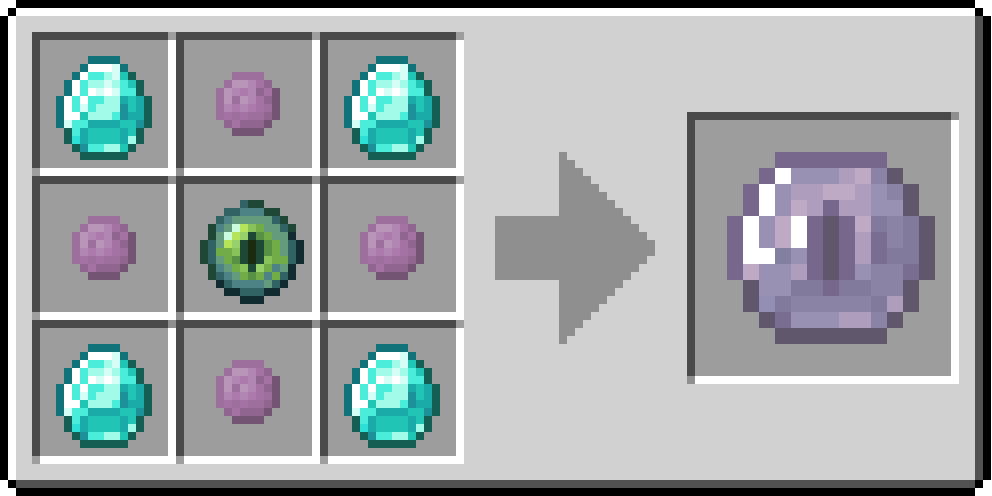<figcaption>
Cuadrícula de crafteo
</figcaption></figure>



- Craftear Bloque de Enderita (9 lingotes)
- Mejorar herramientas y armadura de netherita a enderita
- Reparar equipo de enderita



### Molde de Herrería (Mejora de Enderita)



<figure><figcaption>
Molde de Herrería — ítem
</figcaption></figure>



**ID:** `captercraft:enderite_upgrade_smithing_template`  
**Versiones:** 1.21.1 · 1.21.11





Molde de herrería. Se aplica a equipo de netherita. Adición: lingote de enderita.

No hay tabla de botín de cofres en los datos del mod. La primera copia está en la pestaña creativa CapterCraft. Las copias extra se craftean a partir de un molde existente.



<figure><figcaption>
Cuadrícula de crafteo — 1 molde en 2
</figcaption></figure>



Mesa de herrería: ítem de netherita + lingote de enderita + este molde → ítem de enderita.



## Equipo de Enderita

**Versiones:** 1.21.1 · 1.21.11  
Resistente al fuego. Se repara con lingotes de enderita. Encantabilidad 18. Durabilidad de herramientas **3120**, velocidad de minado **10.0**, bonus de ataque **+5.0**. Multiplicador de armadura **42**, dureza **4.5**, resistencia al empuje **0.2**.

Solo se obtiene en la **mesa de herrería**: pieza de netherita + lingote de enderita + molde de mejora de enderita.



## Mina Fragmento del Vacío

Islas exteriores del End, Y 32–80.



## Funde un Fragmento de Enderita

Horno o alto horno.



## Craftea un Lingote de Enderita

Diamantes, fragmentos de enderita y un ojo de Ender.



## Duplica el Molde

Diamantes, un molde de mejora de enderita existente y piedra del End.



## Mejora Netherita

Molde + pieza de netherita equivalente + lingote de enderita.



### Herramientas de Enderita

| Espada de Enderita | Pico de Enderita | Hacha de Enderita | Pala de Enderita | Azada de Enderita |
| :---: | :---: | :---: | :---: | :---: |
|  |  |  |  |  |



| Ítem | ID | Ataque | Velocidad |
|---|---|---|---|
| Espada de Enderita | `captercraft:enderite_sword` | 3.0 | −2.0 |
| Pico de Enderita | `captercraft:enderite_pickaxe` | 1.0 | −2.4 |
| Hacha de Enderita | `captercraft:enderite_axe` | 5.0 | −2.5 |
| Pala de Enderita | `captercraft:enderite_shovel` | 1.5 | −2.5 |
| Azada de Enderita | `captercraft:enderite_hoe` | −4.0 | 1.0 |



<figure><figcaption>
Mesa de herrería — las cinco herramientas
</figcaption></figure>

Mesa de herrería, para cada pieza:

1. Molde de Mejora de Enderita
2. Herramienta de **netherita** equivalente
3. Lingote de Enderita



Herramientas de final de partida por encima de la netherita. No se queman en fuego ni lava.



### Armadura de Enderita

| Casco de Enderita | Peto de Enderita | Grebas de Enderita | Botas de Enderita |
| :---: | :---: | :---: | :---: |
| 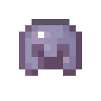 |  |  | 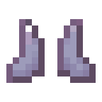 |



| Ítem | ID | Defensa |
|---|---|---|
| Casco de Enderita | `captercraft:enderite_helmet` | 4 |
| Peto de Enderita | `captercraft:enderite_chestplate` | 9 |
| Grebas de Enderita | `captercraft:enderite_leggings` | 7 |
| Botas de Enderita | `captercraft:enderite_boots` | 4 |



<figure>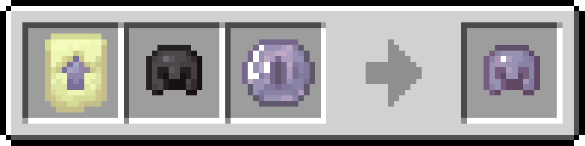<figcaption>
Mesa de herrería — las cuatro piezas
</figcaption></figure>

Mesa de herrería: molde + armadura de **netherita** equivalente + lingote de enderita.



Armadura de final de partida por encima de la netherita. Resistente al fuego.



## Recetas Extra

No añaden ítems. Funcionan en **1.21.1 y 1.21.11**.

| Entrada | Salida | Horno | Alto horno | XP |
|---|---|---|---|---|
| Bloque de Hierro en Bruto | Bloque de Hierro | 90 s | 45 s | 6.3 |
| Bloque de Oro en Bruto | Bloque de Oro | 90 s | 45 s | 6.3 |
| Bloque de Cobre en Bruto | Bloque de Cobre | 90 s | 45 s | 6.3 |

<figure>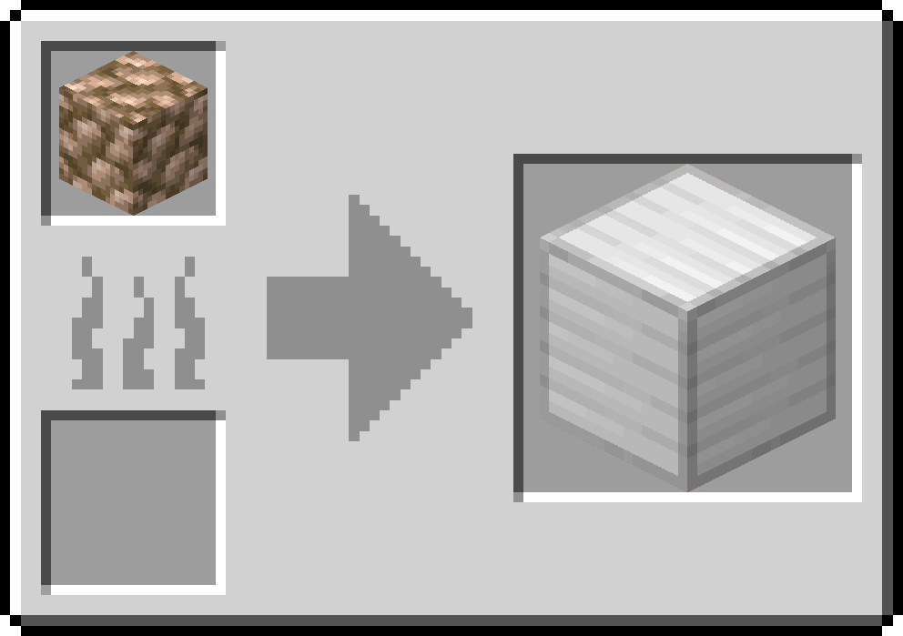<figcaption>
Horno / alto horno — hierro, oro y cobre
</figcaption></figure>

Cobre (solo Minecraft 1.21.1)

En 1.21.11 usa el cobre vanilla. Las estadísticas de abajo son las de **1.0.1**.

### Pepita de Cobre



<figure><figcaption>
Pepita de Cobre — ítem
</figcaption></figure>



**ID:** `captercraft:copper_nugget`  
**Versiones:** **solo 1.21.1** (en 1.21.11 es vanilla)





Crafteo flexible de cobre y reciclaje del equipo de cobre.



| 9 pepitas → 1 lingote | 1 lingote → 9 pepitas |
| :---: | :---: |
| 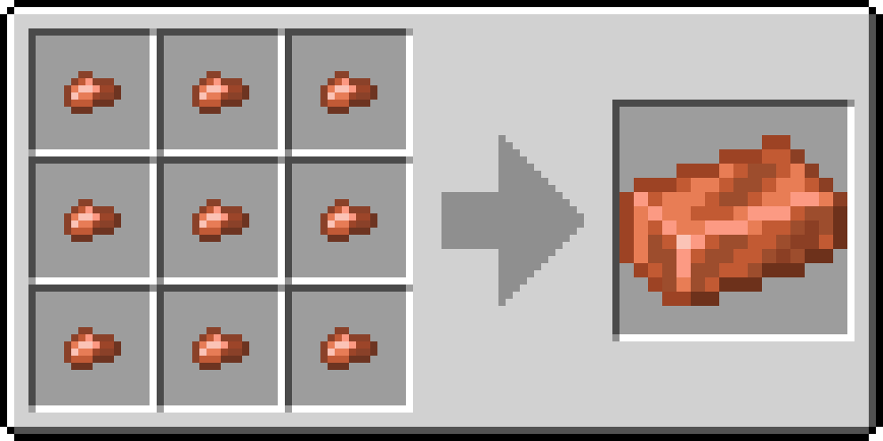 | 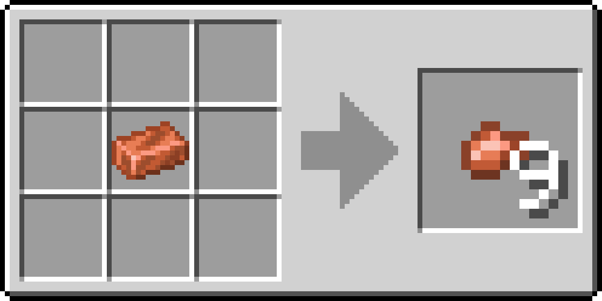 |

| Entrada | Salida | Horno | Alto horno | XP |
|---|---|---|---|---|
| Herramienta o pieza de armadura de cobre | Pepita de Cobre | 10 s | 10 s | 0.7 |

<figure>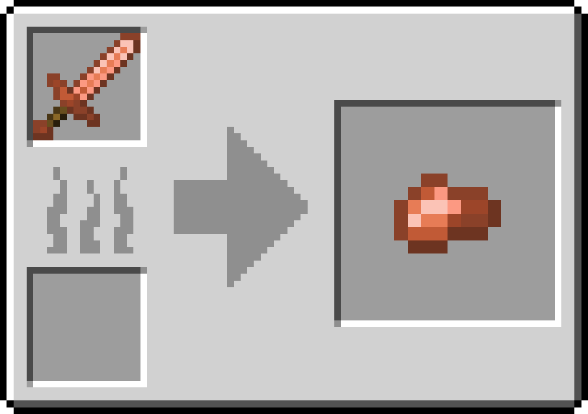<figcaption>
Horno / alto horno — reciclar equipo
</figcaption></figure>



Fundir o explotar cualquier herramienta o pieza de armadura de cobre recupera 1 pepita.



### Herramientas de Cobre

| Espada de Cobre | Pico de Cobre | Hacha de Cobre | Pala de Cobre | Azada de Cobre |
| :---: | :---: | :---: | :---: | :---: |
|  |  |  | 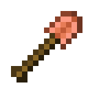 |  |



Durabilidad **190**. Velocidad de minado **5.0**. Bonus de ataque **+1.0**. Encantabilidad **13**. Nivel de cosecha como la piedra. Se repara con lingotes de cobre.

| Ítem | ID | Ataque | Velocidad |
|---|---|---|---|
| Espada de Cobre | `captercraft:copper_sword` | 3.0 | −2.4 |
| Pico de Cobre | `captercraft:copper_pickaxe` | 1.0 | −2.8 |
| Hacha de Cobre | `captercraft:copper_axe` | 7.0 | −3.2 |
| Pala de Cobre | `captercraft:copper_shovel` | 1.5 | −3.0 |
| Azada de Cobre | `captercraft:copper_hoe` | −1.0 | −2.0 |



<figure>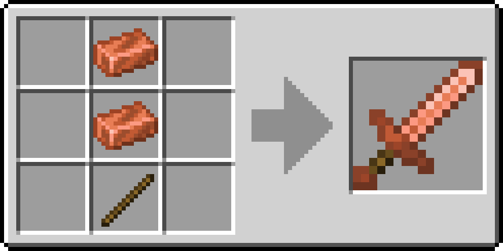<figcaption>
Cuadrícula de crafteo — las cinco herramientas
</figcaption></figure>



Equipo temprano entre piedra e hierro. Fundir o explotar cualquier pieza recupera una pepita de cobre.



### Armadura de Cobre

| Casco de Cobre | Peto de Cobre | Grebas de Cobre | Botas de Cobre |
| :---: | :---: | :---: | :---: |
|  |  | 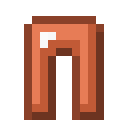 |  |



Multiplicador de durabilidad **11** (casco 121, peto 176, grebas 165, botas 143). Encantabilidad **8**. Dureza 0.

| Ítem | ID | Defensa |
|---|---|---|
| Casco de Cobre | `captercraft:copper_helmet` | 2 |
| Peto de Cobre | `captercraft:copper_chestplate` | 4 |
| Grebas de Cobre | `captercraft:copper_leggings` | 3 |
| Botas de Cobre | `captercraft:copper_boots` | 1 |



<figure>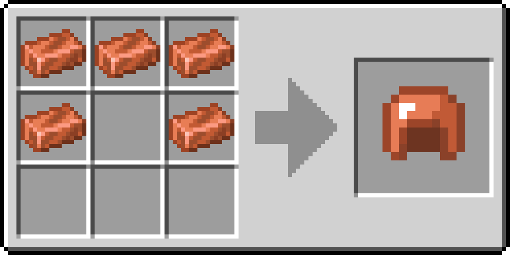<figcaption>
Cuadrícula de crafteo — las cuatro piezas
</figcaption></figure>



Armadura temprana. Fundir o explotar cualquier pieza recupera una pepita de cobre.



